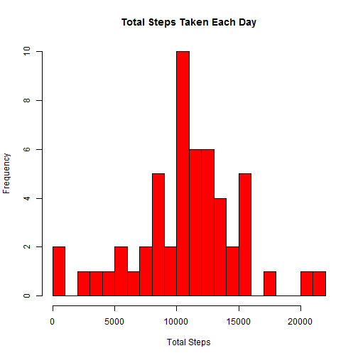
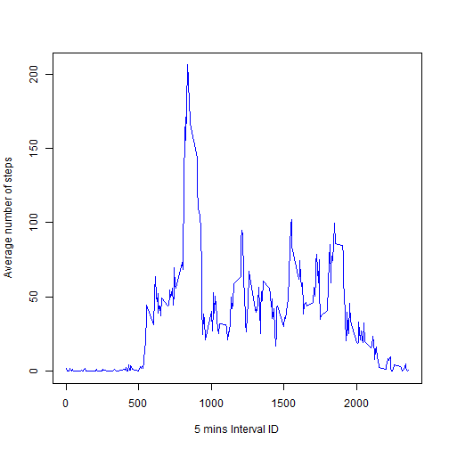
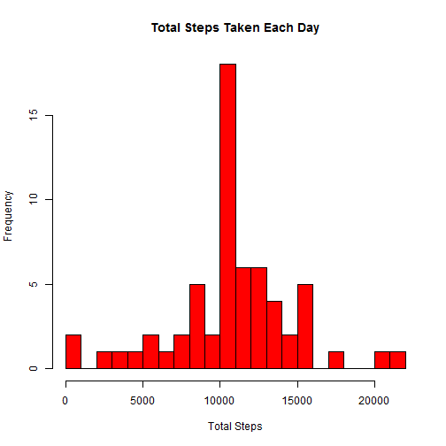
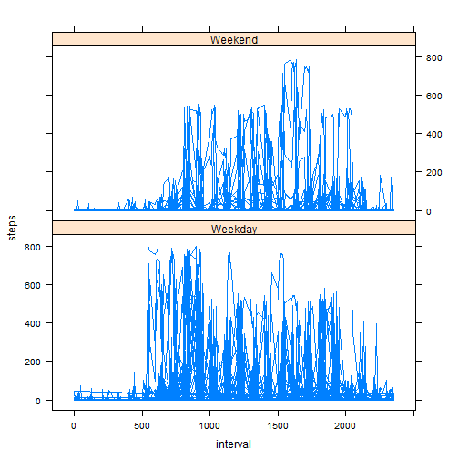

# Reproducible Research: Peer Assessment 1

## Loading and preprocessing the data

```r
        setwd("c:/r/knitr//RepData_PeerAssessment1")
        data<-read.csv(file = "activity.csv")
```


## What is mean total number of steps taken per day?


```r
        # For this Assignment consider only those observations 
        # for which all data is present
        completed <-data[complete.cases(data),]

        # Create new data frame with list of dates and sum, 
        # mean and median of steps taken for that particular day
        library(plyr)
        dailysteps<-ddply(completed,.(date),summarize,sum=sum(steps), 
                          mean=mean(steps), median=median(steps))

        hist(dailysteps$sum,xlab = "Total Steps", 
             main="Total Steps Taken Each Day", col = "red", breaks=20 )
```

 

```r
        dailysteps[,c("date", "mean","median")]
```

```
##          date    mean median
## 1  2012-10-02  0.4375      0
## 2  2012-10-03 39.4167      0
## 3  2012-10-04 42.0694      0
## 4  2012-10-05 46.1597      0
## 5  2012-10-06 53.5417      0
## 6  2012-10-07 38.2465      0
## 7  2012-10-09 44.4826      0
## 8  2012-10-10 34.3750      0
## 9  2012-10-11 35.7778      0
## 10 2012-10-12 60.3542      0
## 11 2012-10-13 43.1458      0
## 12 2012-10-14 52.4236      0
## 13 2012-10-15 35.2049      0
## 14 2012-10-16 52.3750      0
## 15 2012-10-17 46.7083      0
## 16 2012-10-18 34.9167      0
## 17 2012-10-19 41.0729      0
## 18 2012-10-20 36.0938      0
## 19 2012-10-21 30.6285      0
## 20 2012-10-22 46.7361      0
## 21 2012-10-23 30.9653      0
## 22 2012-10-24 29.0104      0
## 23 2012-10-25  8.6528      0
## 24 2012-10-26 23.5347      0
## 25 2012-10-27 35.1354      0
## 26 2012-10-28 39.7847      0
## 27 2012-10-29 17.4236      0
## 28 2012-10-30 34.0938      0
## 29 2012-10-31 53.5208      0
## 30 2012-11-02 36.8056      0
## 31 2012-11-03 36.7049      0
## 32 2012-11-05 36.2465      0
## 33 2012-11-06 28.9375      0
## 34 2012-11-07 44.7326      0
## 35 2012-11-08 11.1771      0
## 36 2012-11-11 43.7778      0
## 37 2012-11-12 37.3785      0
## 38 2012-11-13 25.4722      0
## 39 2012-11-15  0.1424      0
## 40 2012-11-16 18.8924      0
## 41 2012-11-17 49.7882      0
## 42 2012-11-18 52.4653      0
## 43 2012-11-19 30.6979      0
## 44 2012-11-20 15.5278      0
## 45 2012-11-21 44.3993      0
## 46 2012-11-22 70.9271      0
## 47 2012-11-23 73.5903      0
## 48 2012-11-24 50.2708      0
## 49 2012-11-25 41.0903      0
## 50 2012-11-26 38.7569      0
## 51 2012-11-27 47.3819      0
## 52 2012-11-28 35.3576      0
## 53 2012-11-29 24.4688      0
```

## What is the average daily activity pattern?


```r
        intervaldata<-ddply(completed,.(interval),summarize,sum=sum(steps), 
                            mean=mean(steps), median=median(steps))
        plot(intervaldata$interval, intervaldata$mean, type="l", col="blue", 
             xlab="5 mins Interval ID", ylab="Average number of steps")
```

 

```r
        mostactiveinterval<-intervaldata[which.max(intervaldata$mean),"interval"]
```

On average Interval ID = 835 contains the maximum number of steps

## Imputing missing values


```r
        # Find number of incomplete records
        incompleterecords<-nrow(data)-nrow(completed)
```

Total number of missing records = 2304


```r
        # Set default value for number of steps where value is NA
        # Use mean value from Interval Data
        for (i in 1:nrow(data)) {
                row<-data[i,]
                count<-0
                if(is.na(row$steps)) {
                        
                        data[i,"steps"] <-intervaldata[intervaldata$interval==row$interval, "mean"]
                }
        }

        dailysteps<-ddply(data,.(date),summarize,sum=sum(steps), 
                          mean=mean(steps), median=median(steps))

        hist(dailysteps$sum,xlab = "Total Steps", 
             main="Total Steps Taken Each Day", col = "red", breaks=20 )
```

 

```r
        dailysteps[,c("date", "mean","median")]
```

```
##          date    mean median
## 1  2012-10-01 37.3826  34.11
## 2  2012-10-02  0.4375   0.00
## 3  2012-10-03 39.4167   0.00
## 4  2012-10-04 42.0694   0.00
## 5  2012-10-05 46.1597   0.00
## 6  2012-10-06 53.5417   0.00
## 7  2012-10-07 38.2465   0.00
## 8  2012-10-08 37.3826  34.11
## 9  2012-10-09 44.4826   0.00
## 10 2012-10-10 34.3750   0.00
## 11 2012-10-11 35.7778   0.00
## 12 2012-10-12 60.3542   0.00
## 13 2012-10-13 43.1458   0.00
## 14 2012-10-14 52.4236   0.00
## 15 2012-10-15 35.2049   0.00
## 16 2012-10-16 52.3750   0.00
## 17 2012-10-17 46.7083   0.00
## 18 2012-10-18 34.9167   0.00
## 19 2012-10-19 41.0729   0.00
## 20 2012-10-20 36.0938   0.00
## 21 2012-10-21 30.6285   0.00
## 22 2012-10-22 46.7361   0.00
## 23 2012-10-23 30.9653   0.00
## 24 2012-10-24 29.0104   0.00
## 25 2012-10-25  8.6528   0.00
## 26 2012-10-26 23.5347   0.00
## 27 2012-10-27 35.1354   0.00
## 28 2012-10-28 39.7847   0.00
## 29 2012-10-29 17.4236   0.00
## 30 2012-10-30 34.0938   0.00
## 31 2012-10-31 53.5208   0.00
## 32 2012-11-01 37.3826  34.11
## 33 2012-11-02 36.8056   0.00
## 34 2012-11-03 36.7049   0.00
## 35 2012-11-04 37.3826  34.11
## 36 2012-11-05 36.2465   0.00
## 37 2012-11-06 28.9375   0.00
## 38 2012-11-07 44.7326   0.00
## 39 2012-11-08 11.1771   0.00
## 40 2012-11-09 37.3826  34.11
## 41 2012-11-10 37.3826  34.11
## 42 2012-11-11 43.7778   0.00
## 43 2012-11-12 37.3785   0.00
## 44 2012-11-13 25.4722   0.00
## 45 2012-11-14 37.3826  34.11
## 46 2012-11-15  0.1424   0.00
## 47 2012-11-16 18.8924   0.00
## 48 2012-11-17 49.7882   0.00
## 49 2012-11-18 52.4653   0.00
## 50 2012-11-19 30.6979   0.00
## 51 2012-11-20 15.5278   0.00
## 52 2012-11-21 44.3993   0.00
## 53 2012-11-22 70.9271   0.00
## 54 2012-11-23 73.5903   0.00
## 55 2012-11-24 50.2708   0.00
## 56 2012-11-25 41.0903   0.00
## 57 2012-11-26 38.7569   0.00
## 58 2012-11-27 47.3819   0.00
## 59 2012-11-28 35.3576   0.00
## 60 2012-11-29 24.4688   0.00
## 61 2012-11-30 37.3826  34.11
```

Values and Charts diifer when compared with data with completed cases and data with NA replaced with mean values for specific 5 min Interval.

Frequency of Total number of steps was highest was increased after setting missing data
## Are there differences in activity patterns between weekdays and weekends?


```r
        #dailysteps<-ddply(data,.(date),summarize,sum=sum(steps), 
         #                   mean=mean(steps), median=median(steps))

        days<-weekdays(as.Date(data[,"date"]))
        for(i in 1:length(days)){
                if(days[i] == "Sunday" | days[i] == "Saturday") {
                        days[i]<-"Weekend"     
                } else {
                        days[i]<-"Weekday"     
                }
        }

        data<-cbind(data, days)
        
        library(lattice)

        xyplot(steps~interval|days, data,type = "l")
```

 
